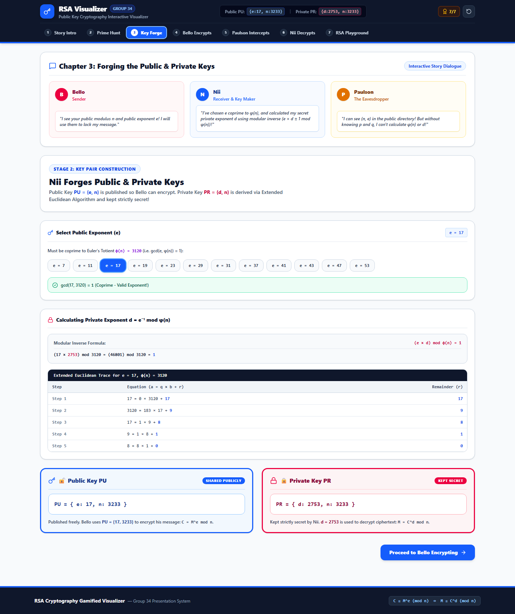
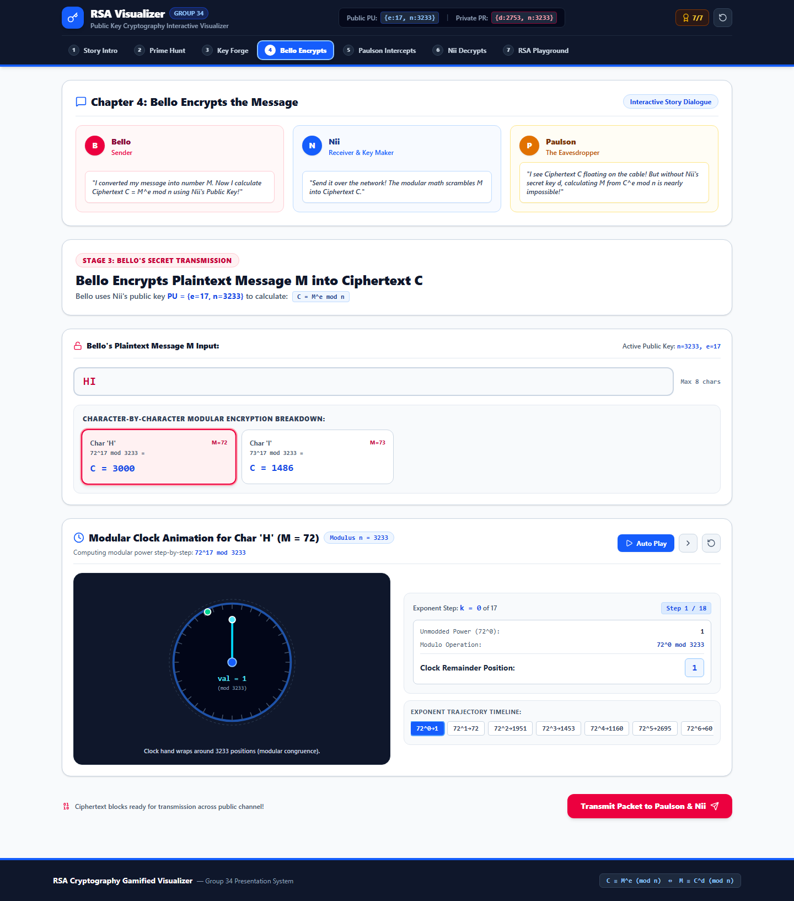
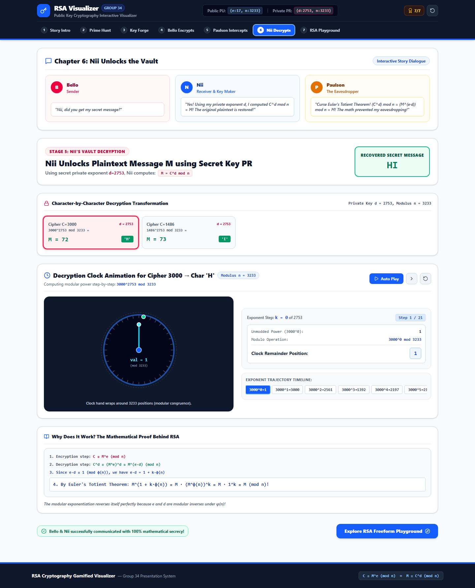
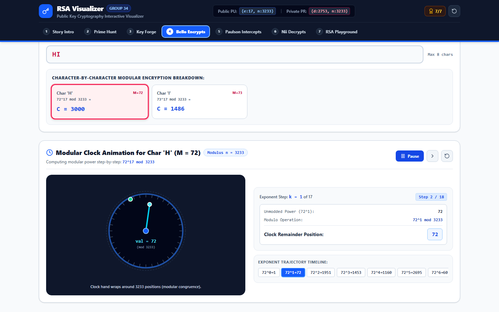
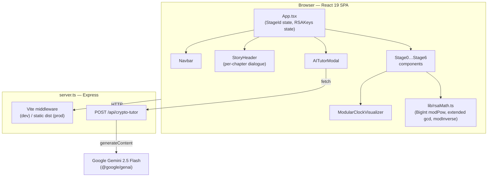

<div align="center">


# RSA Cryptography — Gamified Interactive Visualizer

**A story-driven, mathematically rigorous walkthrough of Public Key Cryptography —
told through Bello (sender), Nii (receiver), and Paulson (the eavesdropper).**

[](https://react.dev)
[](https://www.typescriptlang.org/)
[](https://vitejs.dev)
[](https://tailwindcss.com)
[](https://expressjs.com)
[](https://ai.google.dev)

[Features](#-features) • [Screenshots](#-screenshots) • [How RSA Works](#-how-rsa-works-here) • [Getting Started](#-getting-started) • [Architecture](#-architecture) • [Project Structure](#-project-structure)

</div>

<br/>


<br/>

## Overview

Every HTTPS request, banking session, and encrypted chat leans on the same 1977 idea:
**you can publish a lock that anyone can close, but only you can open.** This project
turns that idea — RSA public-key cryptography — into a hands-on, narrative-driven
lab instead of a wall of equations.

Three characters carry the story through seven chapters:

| Character | Role | What they do in the app |
|---|---|---|
| 🩷 **Bello** | Sender (Alice) | Picks a message, encrypts it with Nii's public key |
| 🔵 **Nii** | Receiver & key maker (Bob) | Generates the prime pair, forges the key pair, decrypts the message |
| 🟠 **Paulson** | Eavesdropper (Eve) | Intercepts the wire, attempts factorization, probes key-size security |

Every number on screen — `p`, `q`, `n`, `φ(n)`, `e`, `d`, every ciphertext block — is
computed live with real modular arithmetic (`BigInt`-backed, no lookup tables), so the
visualizer doubles as a correctness-checked RSA calculator for small keys.

> ⚠️ **Educational use only.** This app intentionally uses tiny, human-scale primes
> (2–4 digits) so every step stays visible and fast. It has **no OAEP/PKCS#1 padding**,
> **no cryptographically secure prime generation**, and maps text directly to ASCII
> code points. Do not use it, or code derived from it, to protect real secrets — use
> a vetted library (`node:crypto`, OpenSSL, libsodium, etc.) for that.

---

## ✨ Features

- **7-chapter interactive story** — a guided narrative from "why can't we just share a
  key?" through key generation, encryption, interception, decryption, and a final
  freeform sandbox. Navigate freely via the chapter bar; nothing is gated.
- **Live modular-clock visualizer** — a custom animated SVG "clock" that plays back
  square-and-multiply modular exponentiation one bit at a time, with play/pause,
  step-forward, reset, and a scrubbable exponent timeline. Watch `M^e mod n` actually
  wrap around the ring instead of just reading the formula.
- **Real prime & key mathematics** — `BigInt`-based modular exponentiation, the
  Extended Euclidean Algorithm (traced step-by-step in a table) for the modular
  inverse `d = e⁻¹ mod φ(n)`, coprimality checks, and Euler's Totient computation —
  all driven by [`src/lib/rsaMath.ts`](src/lib/rsaMath.ts).
- **Paulson's Cryptanalysis Lab** — try to factor `n` back into `p × q` by hand, and
  drag a bit-length slider from 8-bit toy keys to 2048-bit production keys to see
  estimated brute-force factorization time scale from *milliseconds* to
  *3 × 10²⁵ years* (General Number Field Sieve estimate).
  - > 💡 One nuance worth knowing while reading the code: the UI's "secure vs.
    > insecure" badge flips at the 512-bit tier even though 512-bit RSA is
    > considered legacy/broken in the real world — the slider's *time estimates*
    > are accurate, the pass/fail badge threshold is simplified for the demo.
- **Cipher-tampering simulator** — flip a single value in the ciphertext and watch
  decryption collapse into gibberish, demonstrating that RSA (without a MAC) provides
  confidentiality but not integrity on its own.
- **Freeform RSA Playground** — plug in your own primes, message, and public exponent;
  presets for `(7, 11)`, `(61, 53)`, and `(101, 103)` are one click away.
- **Professor Cyber — Gemini-powered AI tutor** — a chat modal wired to a Google
  Gemini 2.5 Flash backend (`POST /api/crypto-tutor`) that answers questions in the
  context of whatever stage and key values you're currently looking at. *(The launch
  button is currently commented out in [`Navbar.tsx`](src/components/Navbar.tsx) —
  see [AI Tutor](#-ai-tutor-professor-cyber) below to re-enable it.)*
- **Confetti-driven feedback** via `canvas-confetti` on key milestones (locking in
  primes, forging keys, successful decryption).
- **Presentation-ready** — [`speech.md`](speech.md) ships a full presenter's script
  with timing, stage directions, and an anticipated Q&A reference table.

---

## 📸 Screenshots

<table>
<tr>
<td width="50%">

**Chapter 1 — Story Intro**
<br/>The open-padlock analogy, interactive.


</td>
<td width="50%">

**Chapter 2 — Prime Hunt**
<br/>Pick `p` and `q`, watch `n` and `φ(n)` compute live.


</td>
</tr>
<tr>
<td width="50%">

**Chapter 3 — Key Forge**
<br/>Extended Euclidean trace deriving private exponent `d`.


</td>
<td width="50%">

**Chapter 4 — Bello Encrypts**
<br/>Per-character encryption plus the modular clock.


</td>
</tr>
<tr>
<td width="50%">

**Chapter 5 — Paulson Intercepts**
<br/>Manual factorization attempts + the 8-bit → 2048-bit security scaler.


</td>
<td width="50%">

**Chapter 6 — Nii Decrypts**
<br/>Recovered plaintext plus the Euler's Totient correctness proof.


</td>
</tr>
<tr>
<td width="50%">

**Chapter 7 — RSA Playground**
<br/>Freeform sandbox with cipher-tampering simulation.


</td>
<td width="50%">

**Modular Clock, mid-animation**
<br/>Square-and-multiply, one exponent bit at a time.


</td>
</tr>
</table>

---

## 🧭 The 7-chapter journey

```mermaid
flowchart LR
    A["1. Story Intro\n(padlock analogy)"] --> B["2. Prime Hunt\np, q → n, φ(n)"]
    B --> C["3. Key Forge\ne, d via Extended Euclid"]
    C --> D["4. Bello Encrypts\nC = M^e mod n"]
    D --> E["5. Paulson Intercepts\nfactorization + bit-size scaler"]
    E --> F["6. Nii Decrypts\nM = C^d mod n"]
    F --> G["7. RSA Playground\nfreeform sandbox"]

    style A fill:#1e293b,stroke:#3b82f6,color:#fff
    style B fill:#1e293b,stroke:#3b82f6,color:#fff
    style C fill:#1e293b,stroke:#3b82f6,color:#fff
    style D fill:#1e293b,stroke:#e11d48,color:#fff
    style E fill:#1e293b,stroke:#d97706,color:#fff
    style F fill:#1e293b,stroke:#e11d48,color:#fff
    style G fill:#1e293b,stroke:#9333ea,color:#fff
```



Navigation is state-driven (`App.tsx` holds `currentStage: StageId`), not URL-routed —
every chapter button in the nav bar is always unlocked, so you can jump around freely
while presenting.

---

## 🔢 How RSA works, here

The app defaults to the classic textbook example (the same one used on Wikipedia's
RSA article), so the numbers you see on first load are:

```
p = 61, q = 53
n   = p × q            = 3233
φ(n) = (p-1)(q-1)       = 60 × 52 = 3120
e   = 17                (chosen, coprime to φ(n))
d   = e⁻¹ mod φ(n)      = 2753   (17 × 2753 mod 3120 = 1)
```

```mermaid
sequenceDiagram
    participant Nii as Nii (Receiver)
    participant Net as Public Channel
    participant Bello as Bello (Sender)
    participant Paulson as Paulson (Eavesdropper)

    Nii->>Nii: Choose primes p, q → n, φ(n)
    Nii->>Nii: Choose e coprime to φ(n); derive d = e⁻¹ mod φ(n)
    Nii->>Net: Publish Public Key PU = {e, n}
    Bello->>Net: C = M^e mod n, using PU
    Net-->>Paulson: Intercepts (n, e, C)
    Paulson->>Paulson: Attempts to factor n → p × q (fails at real-world scale)
    Net->>Nii: Delivers C
    Nii->>Nii: M = C^d mod n, using private d
```

**Why decryption recovers the exact original message:** because `e` and `d` are
modular inverses under `φ(n)` (i.e. `e·d ≡ 1 mod φ(n)`), Euler's Totient Theorem
guarantees `(M^e)^d ≡ M^(1 + k·φ(n)) ≡ M · (M^φ(n))^k ≡ M · 1^k ≡ M (mod n)`. Chapter 6
renders this derivation line-by-line next to the live numbers.

**Why it's hard to break:** multiplying two primes is near-instant; recovering them
from the product (`n`) is not known to be efficiently solvable classically. Chapter 5
lets you feel that asymmetry directly — factor `n = 3233` yourself, then watch the
same attack's estimated cost balloon as the modulus grows toward 2048 bits.

---

## 🚀 Getting Started

### Prerequisites

- [Node.js](https://nodejs.org/) 18+ (uses native `BigInt`, ES2022 target)
- npm (a `package-lock.json` is committed; a `bun.lock` is also present if you prefer [Bun](https://bun.sh/))

### Install & run

```bash
# 1. Install dependencies
npm install

# 2. (Optional) configure the AI tutor backend
cp .env.example .env
# then edit .env and set GEMINI_API_KEY

# 3. Start the dev server (Express + Vite middleware, hot reload)
npm run dev
```

The app is served at **http://localhost:3000**.

### Available scripts

| Script | What it does |
|---|---|
| `npm run dev` | Runs `server.ts` via `tsx`, with Vite in middleware mode for HMR |
| `npm run build` | Builds the client with Vite, then bundles `server.ts` to `dist/server.cjs` with esbuild |
| `npm start` | Runs the production bundle (`node dist/server.cjs`), serving `dist/` as static assets |
| `npm run preview` | Vite's built-in preview of the production client build |
| `npm run lint` | Type-checks the project with `tsc --noEmit` |
| `npm run clean` | Removes `dist/` and the compiled `server.cjs` |

### Environment variables

| Variable | Required | Purpose |
|---|---|---|
| `GEMINI_API_KEY` | Only for the AI tutor endpoint | Server-side key for `@google/genai`, used by `POST /api/crypto-tutor` |
| `APP_URL` | No (AI-Studio hosting convenience) | Self-referential URL used when deployed on Google AI Studio / Cloud Run |

Without `GEMINI_API_KEY`, every other feature (all 7 chapters, the clock visualizer,
the sandbox) works fully offline — only the `/api/crypto-tutor` route will respond
with a 500 explaining the key is missing.

---

## 🏗 Architecture



- **Single Express server** (`server.ts`) does double duty: in development it mounts
  Vite in middleware mode for instant HMR; in production it serves the static
  `dist/` build and falls back to `index.html` for the SPA.
- **One API route**, `POST /api/crypto-tutor`, lazily instantiates a `GoogleGenAI`
  client and forwards the learner's question plus the *current visualizer state*
  (active chapter, `p, q, n, φ(n), e, d`) as context to Gemini 2.5 Flash, so answers
  stay grounded in what's on screen.
- **All cryptographic math is client-side and dependency-free** — `src/lib/rsaMath.ts`
  uses native `BigInt` for modular exponentiation and the Extended Euclidean
  Algorithm, so it works fully offline and is trivially unit-testable.
- **State lives in `App.tsx`**, not Redux/Context — `currentStage`, the shared
  `RSAKeys`, and `encryptedBlocks` are lifted to the top and passed down; each stage
  component is otherwise self-contained with its own local UI state.

---

## 📁 Project Structure

```
rsa-cryptographyvisualizer/
├── docs/
│   └── screenshots/              # README screenshots
├── public/
│   ├── logoicon.png
│   └── assets/logoicon.png
├── src/
│   ├── components/
│   │   ├── stages/
│   │   │   ├── Stage0Intro.tsx              # Ch.1 — padlock analogy
│   │   │   ├── Stage1PrimeSelection.tsx     # Ch.2 — pick p, q
│   │   │   ├── Stage2KeyForge.tsx           # Ch.3 — derive e, d
│   │   │   ├── Stage3Encryption.tsx         # Ch.4 — Bello encrypts
│   │   │   ├── Stage4EveInterception.tsx    # Ch.5 — Paulson attacks
│   │   │   ├── Stage5Decryption.tsx         # Ch.6 — Nii decrypts
│   │   │   └── Stage6SandboxPlayground.tsx  # Ch.7 — freeform sandbox
│   │   ├── AITutorModal.tsx        # "Professor Cyber" chat UI
│   │   ├── ModularClockVisualizer.tsx  # Animated modular-exponentiation clock
│   │   ├── Navbar.tsx              # Chapter nav + live key status pill
│   │   └── StoryHeader.tsx         # Per-chapter character dialogue
│   ├── lib/
│   │   └── rsaMath.ts              # All RSA math: modPow, extended gcd, modInverse…
│   ├── App.tsx                     # Top-level state + stage router
│   ├── main.tsx                    # React root
│   ├── index.css                   # Tailwind v4 entry + custom scrollbars
│   └── types.ts                    # StageId, RSAKeys, EncryptedBlock, ChatMessage
├── server.ts                       # Express: Vite middleware (dev) / static (prod) + AI route
├── index.html                      # Vite entry HTML
├── speech.md                       # Full presenter's script & Q&A guide
├── metadata.json                   # App metadata (AI Studio hosting)
├── vite.config.ts
├── tsconfig.json
└── package.json
```

---

## 🧮 `rsaMath.ts` reference

The entire mathematical core lives in one dependency-free file:
[`src/lib/rsaMath.ts`](src/lib/rsaMath.ts).

| Function | Signature | Purpose |
|---|---|---|
| `isPrime` | `(n: number) => boolean` | Trial-division primality test (6k±1 optimization) |
| `gcd` | `(a, b: number) => number` | Euclidean greatest common divisor |
| `getExtendedGcdSteps` | `(a, b: number) => ExtendedGcdStep[]` | Row-by-row trace of the Euclidean algorithm, rendered as a table in Chapter 3 |
| `modInverse` | `(e, phi: number) => number \| null` | Extended Euclidean modular inverse; returns `null` if not coprime |
| `modPow` | `(base, exp, mod: number) => number` | `BigInt`-backed fast modular exponentiation (square-and-multiply) |
| `getModPowSteps` | `(base, exp, mod: number) => ModPowStep[]` | Bit-by-bit trace of `modPow`, driving the clock visualizer's timeline |
| `getFriendlyPrimes` | `() => number[]` | Curated small-prime list for the Chapter 2 picker |
| `findValidExponents` | `(phi: number) => number[]` | Filters candidate `e` values down to those coprime with `φ(n)` |
| `stringToMessageNumbers` | `(text: string, maxN: number) => number[]` | ASCII-encodes text, folding characters that exceed the modulus |
| `messageNumbersToString` | `(nums: number[]) => string` | Inverse of the above, for rendering recovered plaintext |

---

## 🤖 AI Tutor ("Professor Cyber")

The app ships a full chat modal — [`AITutorModal.tsx`](src/components/AITutorModal.tsx)
— backed by Gemini 2.5 Flash, with four preset conceptual questions and free-form
chat. It sends the learner's question **and** the live visualizer context (current
chapter, `p, q, n, φ(n), e, d`) to the server so answers can reference the exact
numbers on screen.

The trigger button in the navbar is currently commented out
([`Navbar.tsx`](src/components/Navbar.tsx), search for `ai-tutor-btn`). To re-enable it:

1. Uncomment the `<button id="ai-tutor-btn" …>` block in `Navbar.tsx`.
2. Set `GEMINI_API_KEY` in `.env` (see [Environment variables](#environment-variables)).
3. Restart `npm run dev`.

---

## 🎓 Presenting this project

[`speech.md`](speech.md) contains a full ~12-minute presenter's script — phase-by-phase
stage directions, speaker notes for every chapter, and an anticipated Q&A table
(e.g. *"Why is `e = 65537` used in real RSA?"*, *"Can quantum computers break RSA?"*).
It's written to be read alongside the live app on a projector.

---

## 🛠 Tech Stack

| Layer | Choice |
|---|---|
| UI framework | React 19 + TypeScript 5.8 |
| Build tool | Vite 6 |
| Styling | Tailwind CSS v4 (`@tailwindcss/vite`) |
| Icons | lucide-react |
| Motion/feedback | canvas-confetti |
| Server | Express 4 (dev: Vite middleware · prod: static + SPA fallback) |
| AI tutor | Google Gemini 2.5 Flash via `@google/genai` |
| Production bundling | esbuild (server) + Vite/Rollup (client) |
| Math | Native `BigInt` — no crypto/bignum library dependency |

---

## 🤝 Contributing

This started as a Group 34 coursework presentation on Public Key Cryptography, but
issues and PRs that improve the math accuracy, accessibility, or add new visualizers
are welcome. Please run `npm run lint` before opening a PR.

## 📄 License

No license has been published for this repository yet — all rights are reserved by
default. If you'd like to reuse this project, please reach out to the repository owner
first.

---

<div align="center">

**RSA Cryptography Gamified Visualizer** — built by Group 34

`C ≡ Mᵉ (mod n)`  ⇄  `M ≡ C^d (mod n)`

</div>
